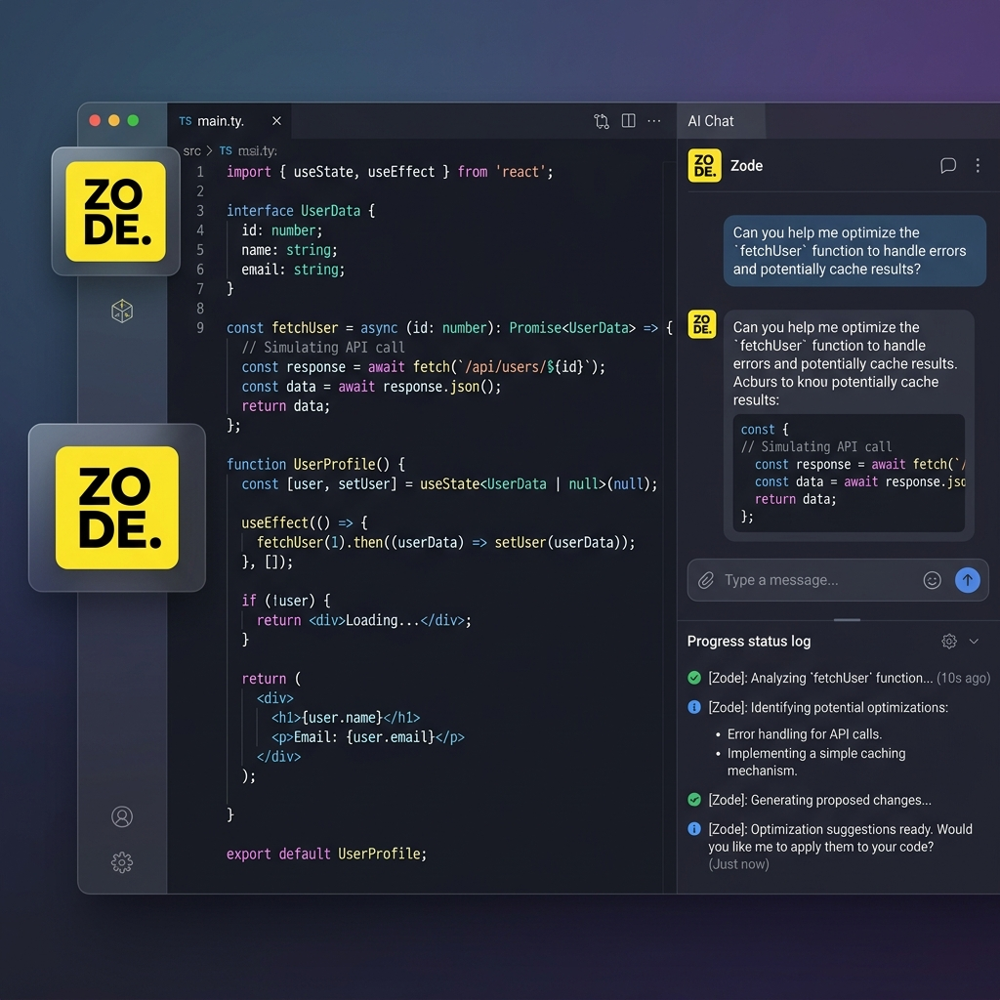

<p align="center">
  <a href="https://marketplace.visualstudio.com/items?itemName=zodecode.Zode-Code"></a>
  <a href="https://x.com/zodecode"></a>
  <a href="https://blog.zode.ai"></a>
  <a href="https://zode.ai/discord"></a>
  <a href="https://www.reddit.com/r/zodecode/"></a>
</p>

<p align="center">
  <a href="https://zode.ai"></a>
</p>

<p align="center">
  <strong>Zode is the all-in-one agentic engineering platform.</strong><br>
  Build, ship, and iterate faster with the most popular open source coding agent.
</p>

<p align="center">
  
</p>

<p align="center">
  <a href="https://zode.ai">Website</a> ·
  <a href="https://zode.ai/install">Install</a> ·
  <a href="https://zode.ai/landing/vs-code">IDE</a> ·
  <a href="https://zode.ai/cli">CLI</a> ·
  <a href="https://zode.ai/docs">Docs</a> ·
  <a href="https://zode.ai/leaderboard">Models</a> ·
  <a href="https://zode.ai/gateway">Gateway</a> ·
  <a href="https://zode.ai/pricing">Pricing</a> ·
  <a href="https://zode.ai/pricing/zode-pass">Zode Pass</a>
</p>

<p align="center">
  500+ models. One open source agent in <a href="https://zode.ai/install">VS Code</a>, <a href="https://zode.ai/features/jetbrains-native">JetBrains</a>, <a href="https://zode.ai/cli">CLI</a>, <a href="https://zode.ai/slack">Slack</a>, and <a href="https://zode.ai/cloud">Cloud</a>.
</p>

- ✨ Generate code from natural language
- ✅ Checks its own work
- 🧪 Run terminal commands
- 🌐 Automate the browser
- ⚡ Inline autocomplete suggestions
- 🤖 Latest AI models
- 🎁 API keys optional

## Quick Links

- [VS Code Marketplace](https://zode.ai/vscode-marketplace?utm_source=Readme) (download)
- Install CLI: `npm install -g @zodecode/cli`
- [Official zode.ai Home page](https://zode.ai) (learn more)

## Key Features

- **Code Generation:** Zode can generate code using natural language.
- **Inline Autocomplete:** Get intelligent code completions as you type, powered by AI.
- **Task Automation:** Zode can automate repetitive coding tasks to save time.
- **Automated Refactoring:** Zode can refactor and improve existing code efficiently.
- **MCP Server Marketplace**: Zode can easily find, and use MCP servers to extend the agent capabilities.
- **Multi Mode**: Plan with Architect, Code with Coder, and Debug with Debugger, and make your own custom modes.

## Get Started in Visual Studio Code

1. Install the Zode Code extension from the [VS Code Marketplace](https://marketplace.visualstudio.com/items?itemName=zodecode.Zode-Code).
2. Create your account to access 500+ cutting-edge AI models including GPT-5.5, Claude Opus 4.7, Claude Sonnet 4.6, and Gemini 3.1 Pro Preview, with transparent pricing that matches provider rates exactly.
3. Start coding with AI that adapts to your workflow. Watch our quick-start guide to see Zode in action:

<a href="https://youtu.be/pqGfYXgrhig"></a>

## Get Started with the CLI

```bash
# npm
npm install -g @zodecode/cli

# Or run directly with npx
npx @zodecode/cli
```

Then run `zode` in any project directory to start.

<!-- zodecode_change start -->

### npm Install Note: Hidden `.zode` File

On some systems and npm versions, installing `@zodecode/cli` can create a hidden `.zode` file near the installed `zode` command (for example in a global npm bin directory). This file is an npm-generated launcher helper, not project data.

- Why it exists: npm may create helper artifacts while wiring CLI executables.
- Size caveat: size can vary by platform, npm version, and install mode (symlink vs copied launcher), so a strict fixed size is not guaranteed.
- Safety: it is safe to leave in place. Do not edit it manually. Use your package manager's uninstall (`npm uninstall -g @zodecode/cli`) to remove install artifacts cleanly.
<!-- zodecode_change end -->

### Install from GitHub Releases (Optional)

Download the latest binary or source code from the [Releases page](https://github.com/Zode-Org/zodecode/releases), use this quick guide:

- `zode-<os>-<arch>.zip` is the CLI binary for your OS and CPU architecture on Windows and macOS. (`zode-linux-<arch>.tar.gz` for Linux)
- `darwin` means macOS.
- `x64` is standard 64-bit Intel/AMD CPUs.
- `x64-baseline` is a compatibility build for older x64 CPUs(do not support AVX Instruction).
- `arm64` is ARM-based Linux/MacOS.
- `musl` is statically linked Linux build for Alpine/minimal Docker without glibc. Alpine/minimal Docker users should prefer the matching \*-musl asset.
- `zode-vscode-*.vsix` is the VS Code extension package and not the CLI binary.
- `Source code` releases are for building from source, not normal installation.

For most users:

- **Windows (most PCs):** `zode-windows-x64.zip`
- **macOS Apple Silicon:** `zode-darwin-arm64.zip`
- **macOS Intel:** `zode-darwin-x64.zip`
- **Linux x64:** `zode-linux-x64.tar.gz`
- **Linux on ARM:** `zode-linux-arm64.tar.gz`

### Autonomous Mode (CI/CD)

Use the `--auto` flag with `zode run` to enable fully autonomous operation without user interaction. This is ideal for CI/CD pipelines and automated workflows:

```bash
zode run --auto "run tests and fix any failures"
```

**Important:** The `--auto` flag disables all permission prompts and allows the agent to execute any action without confirmation. Only use this in trusted environments like CI/CD pipelines.

## Contributing

We welcome contributions from developers, writers, and enthusiasts!
To get started, please read our [Contributing Guide](/CONTRIBUTING.md). It includes details on setting up your environment, coding standards, types of contribution and how to submit pull requests.

See [RELEASING.md](RELEASING.md) for the VS Code extension and CLI release process.

See [packages/zode-jetbrains/RELEASING.md](packages/zode-jetbrains/RELEASING.md) for the JetBrains plugin release process.

## Code of Conduct

Our community is built on respect, inclusivity, and collaboration. Please review our [Code of Conduct](/CODE_OF_CONDUCT.md) to understand the expectations for all contributors and community members.

## License

This project is licensed under the MIT License.
You're free to use, modify, and distribute this code, including for commercial purposes as long as you include proper attribution and license notices. See [License](/LICENSE).

## FAQ

<details>
<summary>Where did Zode CLI come from?</summary>

Zode CLI is a fork of [OpenCode](https://github.com/anomalyco/opencode), enhanced to work within the Zode agentic engineering platform.

</details>
